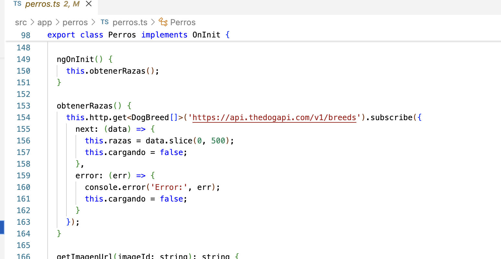
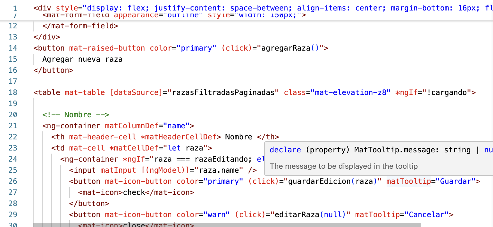
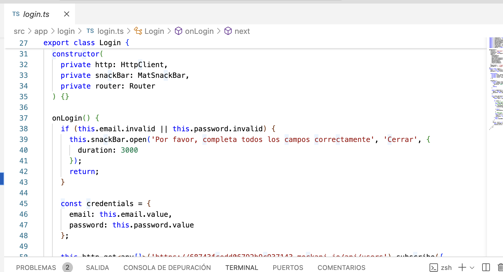
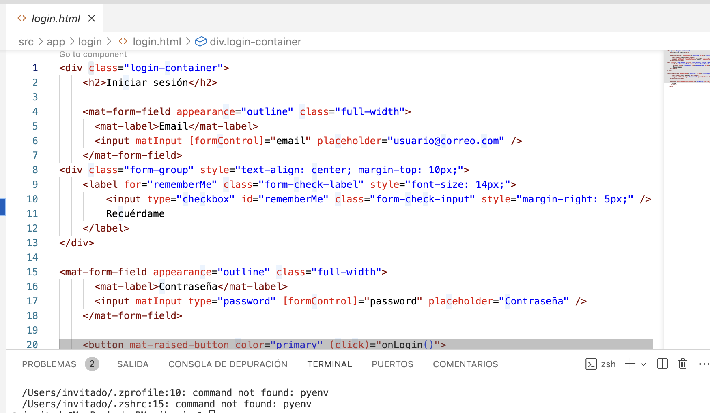
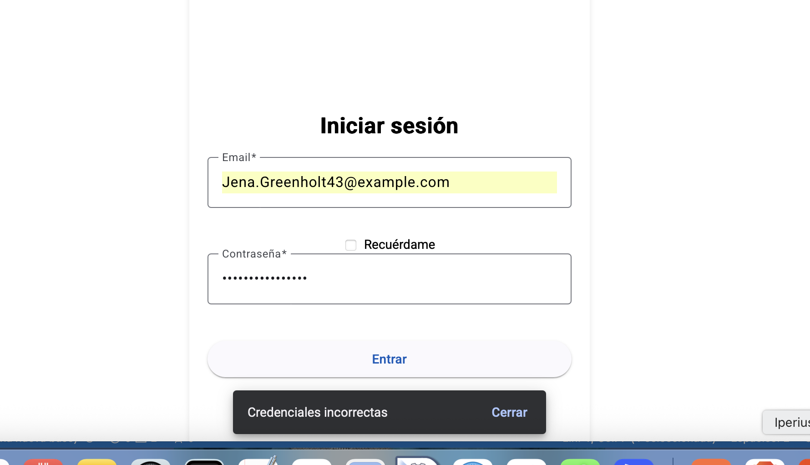
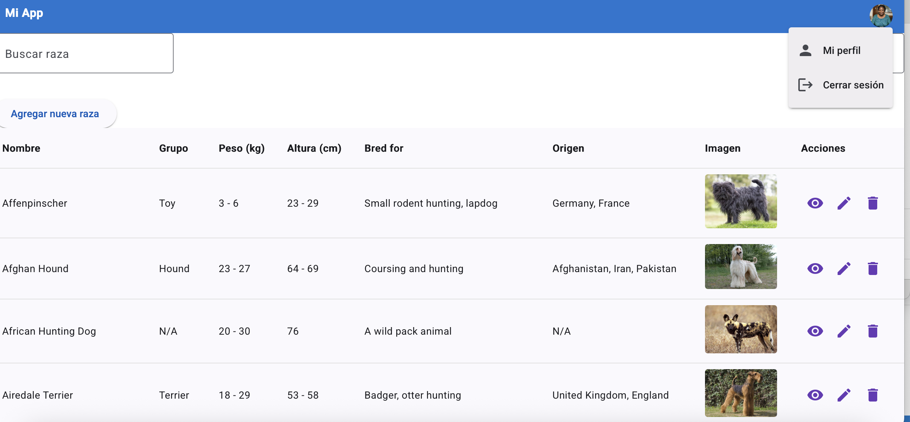

# Usos de APIs en FrontEnd Angular

[](https://github.com/tuusuario/portafolio)
[](https://tuusuario.github.io/portafolio/)

En este proyecto se utilizaron APIS de Usuarios y Perros, para desarrollar un proyecto con angular. Diseñado para ser responsive y accesible.  

## Características  
- **Proyectos destacados** con descripción y tecnologías usadas.  
-  **Diseño responsive** (adaptable a móviles, tablets y desktop).  
-  **Interfaz moderna** con animaciones de Modales y otros componentes.  
-  **Sección de contacto** integrada con redes sociales y formulario.  
-  **SEO optimizado** (meta tags, keywords, etc.).  

## 🌍 Ver Online  
👉 [Haz clic aquí para visitar el sitio](https://romanreynaldo.github.io/FrontEndAPIS/)  
## Puede loggearse con este usuario de ejemplo

**Correo:** `Jena.Greenholt43@example.com`  
**Password:** `uhiDVUHosQ3Kf_Z`

## APIs utilizadas
    https://68743fcedd06792b9c937143.mockapi.io/api/users
    https://api.thedogapi.com/v1/breeds

##  Tecnologías Utilizadas  
- **Frontend**: HTML5, Typescript, Angular 20.  
- **Herramientas**: Git, GitHub Pages, Figma (diseño).  

##  Instalación y Descarga  
### Opción 1: Clonar el repositorio  

``` html
git clone
git clone https://github.com/RomanReynaldo/FrontEndAPIS.git

```


## 🖼️ Capturas de Pantalla

<div align="center">
  
  
  <br>
  
  
  
  
  
</div>


## Licencia
Este proyecto es para fines académicos. El código puede usarse como referencia, pero se requiere atribución.


## Contacto
Reynaldo Roman Mendoza
 rreynaldoromanm@gmail.com
LinkedIn (opcional)


